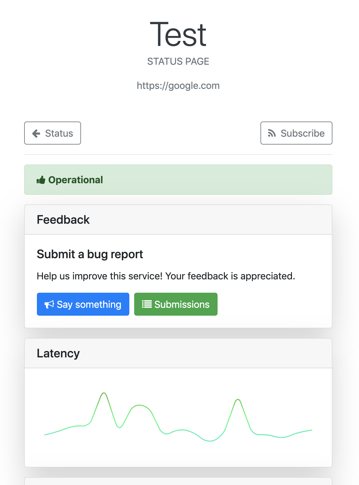
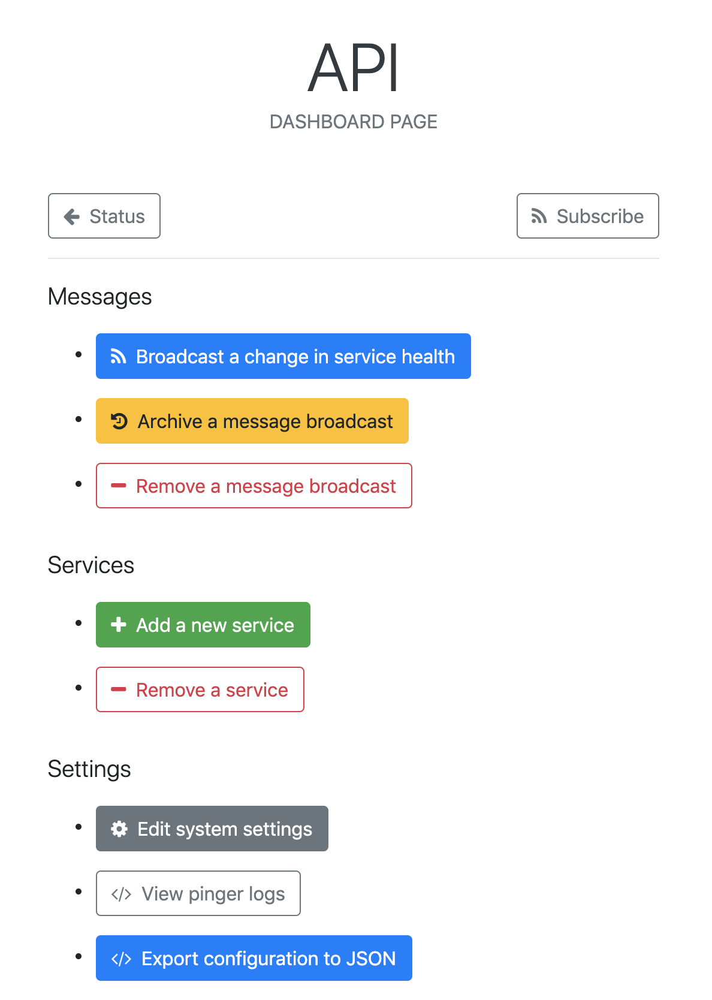

# [uptime](https://khalidx.github.io/uptime/)


An uptime monitoring web application that is easy to understand, use, and extend.


- [uptime](#uptime)
  - [Screenshots](#screenshots)
    - [Status Page](#status-page)
    - [Detail Page](#detail-page)
    - [Dashboard Page](#dashboard-page)
  - [Demo](#demo)
  - [Getting started](#getting-started)
  - [Web](#web)
    - [/status](#status)
    - [/status/{service}](#statusservice)
    - [/dashboard](#dashboard)
  - [API](#api)
  - [Support](#support)
  - [Developers](#developers)
    - [Components](#components)
    - [Usage](#usage)
      - [clone](#clone)
      - [install](#install)
      - [deploy](#deploy)
      - [dev](#dev)
      - [undeploy](#undeploy)
      - [docker](#docker)

## Screenshots

### Status Page


### Detail Page



### Dashboard Page



## Demo

[Click here to view the live demo site.](http://uptime-dev-s3websitebucket-1d3cwui1js8f7.s3-website-us-east-1.amazonaws.com)

## Getting started

`uptime` is easy to deploy to your AWS account, with a one-liner for deployment.

1. Make sure that the `AWS_REGION` and `AWS_PROFILE` environment variables are set, or that you have the appropriate AWS region and credentials configured elsewhere in your environment

2. Make sure that you have `node` and `npm`

3. Clone this repository, with `git clone https://github.com/khalidx/uptime`

4. Run the following command to build and deploy:

```sh
npm install && npm run deploy
```

After deployment, the `WebsiteUrl` for the status page and the `ServiceEndpoint` for the API will be logged to the console.

If you are just trying out `uptime`, you can easily remove it from your AWS account with `npm run undeploy`.

> **Public vs VPC deployments**

By default, the status page site will be **accessible to the internet**.

If you'd like the site to only be accessible within your AWS network, set the following variables in the `serverless.yml` file before deployment.

```yaml
...
custom:
  uptime:
    privacy: vpc
    vpc: <your-vpc-id>
...
```

## Web

This section contains information about what you'll find on each page of the `uptime` web application. 

### /status

- relevant messages
- a listing of all services and their status
- incident history

### /status/{service}

- service status
- latency metrics
- error metrics
- scheduled checks

### /dashboard

- message management
- service management
- settings
- logs
- data export

## API

This section contains information about the `uptime` API and the operations it supports.

| Done | Operations | Path | Description |
|--- |--- |--- |--- |
| ✅ | GET, PUT, DELETE | `/settings` | Manage system settings, like the status page `title` |
| 🚧 | GET, POST | `/services` | Get a list of monitored services or add a service |
| 🚧 | GET, PUT, DELETE | `/services/{serviceId}` | Get or manage a specific service |
| 🚧 | GET, DELETE | `/services/{serviceId}/metrics` | Get service metrics, or reset collected metrics data for a service |
| 🚧 | GET, POST | `/services/{serviceId}/messages` |  Get a list of operational status messages for a service, or add a new message |
| 🚧 | GET, PUT, DELETE | `/services/{serviceId}/messages/{messageId}` |  Get or manage a specific message |
| 🚧 | GET, POST | `/services/{serviceId}/feedback` | Get a list of feedback messages for a service, or submit a feedback message |
| 🚧 | GET, POST | `/services/{serviceId}/feedback/{feedbackId}` | Get or manage a specific feedback message |
| 🚧 | GET, POST | `/services/{serviceId}/checks` | Get the configured checks for a service, like scheduled pings, or add a new service check |
| 🚧 | GET, PUT, DELETE | `/services/{serviceId}/checks/{checkId}` | Get or manage a specific service check |

## Support

[Open a GitHub issue](https://github.com/khalidx/uptime/issues/new) to ask a question, report a bug, raise a concern, or request a new feature.

- [Completed features](https://github.com/khalidx/uptime/issues?utf8=%E2%9C%93&q=is%3Aclosed+label%3Aenhancement)
- [Open issues](https://github.com/khalidx/uptime/issues)

## Developers

This section is for developers looking to develop, modify, or extend this project.

### Components

- `src/app/` (the uptime serverless application backend)
- `src/ui/` (the uptime web application frontend)

### Usage

Prerequisites:

- `node` and `npm`
- Ensure the `AWS_REGION` and `AWS_PROFILE` environment variables are set, or that you have the appropriate AWS region and credentials configured elsewhere in your environment.

#### clone

Clone the repository from GitHub.

```sh
git clone https://github.com/khalidx/uptime && cd uptime
```

#### install

Install the project dependencies.

```sh
npm install
```

#### deploy

Deploy the application and site to AWS.

```sh
npm run deploy
```

#### dev

Starts the project with a development server and hot-reload, for developing the backend and front-end, locally.

Make sure the application is deployed first, so that non-local assets (like DynamoDb) are available for use.

```sh
npm run dev
```

#### undeploy

Remove the site and application from AWS.

```sh
npm run undeploy
```

#### docker

Alternatively, build, deploy the backend, and run the UI with Docker.

Make sure to provide your AWS credentials and target region as build arguments.

```sh
docker build \
--build-arg AWS_ACCESS_KEY_ID=<your-aws-key> \
--build-arg AWS_SECRET_ACCESS_KEY=<your-aws-secret> \
--build-arg AWS_REGION=us-east-1 \
-t uptime .

docker run --rm -p 8080:8080 uptime
```
